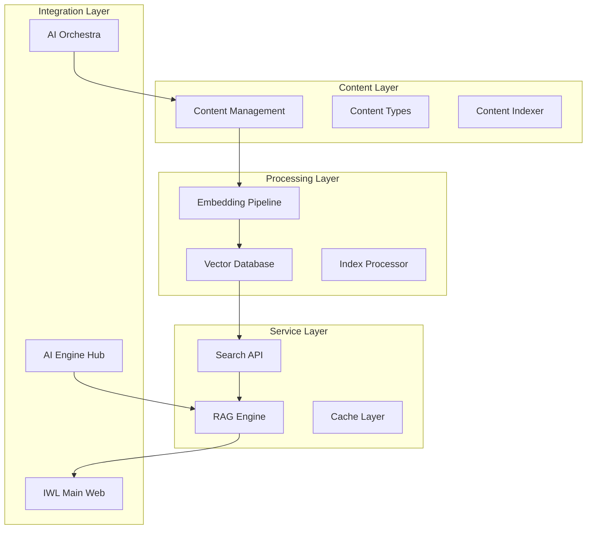

# IWL Knowledge Base Architecture

## System Overview



## Core Components

### 1. Content Management System
- **Purpose**: Organize and manage educational content
- **Features**:
  - Content versioning
  - Metadata management
  - Multi-language support
  - Content validation

### 2. Embedding Pipeline
- **Purpose**: Convert content to vector representations
- **Process**:
  1. Text preprocessing
  2. Chunking strategy
  3. Embedding generation
  4. Vector optimization

### 3. Vector Database
- **Options**:
  - **Pinecone**: Managed service, easy scaling
  - **ChromaDB**: Self-hosted, full control
  - **Weaviate**: Hybrid search capabilities
  
### 4. Search Engine
- **Types**:
  - Semantic search (vector similarity)
  - Keyword search (BM25)
  - Hybrid search (combining both)
  
### 5. RAG System
- **Components**:
  - Context retrieval
  - Prompt engineering
  - Response generation
  - Quality scoring

## Data Flow

### Ingestion Flow
```
Raw Content -> Preprocessing -> Chunking -> Embedding -> Vector DB
```

### Query Flow
```
User Query -> Embedding -> Vector Search -> Context Assembly -> LLM -> Response
```

## Technology Choices

### Embedding Models
| Model | Pros | Cons | Use Case |
|-------|------|------|----------|
| OpenAI Ada-002 | High quality, API-based | Cost, API dependency | Production |
| Sentence-BERT | Open source, fast | Lower quality | Development |
| Multilingual-E5 | Multi-language | Larger size | International |

### Vector Databases
| Database | Pros | Cons | Use Case |
|----------|------|------|----------|
| Pinecone | Managed, scalable | Cost, vendor lock-in | Quick start |
| ChromaDB | Open source, embedded | Self-managed | Full control |
| Weaviate | Hybrid search, GraphQL | Complex setup | Advanced features |

### LLM Integration
| Model | Pros | Cons | Use Case |
|-------|------|------|----------|
| GPT-4 | Best quality | Cost, rate limits | Complex queries |
| Claude | Good reasoning | API availability | Analysis tasks |
| Gemini | Fast, multi-modal | Newer, less tested | Experimentation |

## Performance Optimization

### Caching Strategy
1. **Query Cache**: Recent searches
2. **Embedding Cache**: Frequent content
3. **Response Cache**: Common Q&A

### Indexing Strategy
1. **Hierarchical indexing**: Course > Module > Lesson
2. **Cross-references**: Related content links
3. **Temporal indexing**: Version tracking

### Search Optimization
1. **Pre-filtering**: Metadata filters before vector search
2. **Approximate search**: Trade accuracy for speed
3. **Result re-ranking**: Combine multiple signals

## Security & Privacy

### Data Protection
- Encryption at rest (AES-256)
- Encryption in transit (TLS 1.3)
- Access control (OAuth 2.0)
- Audit logging

### Content Security
- Input sanitization
- Output filtering
- PII detection
- Content moderation

## Scalability Plan

### Phase 1: MVP (Current)
- Single instance
- Local vector DB
- Basic caching
- ~1000 documents

### Phase 2: Growth
- Distributed setup
- Managed vector DB
- Redis caching
- ~10,000 documents

### Phase 3: Scale
- Kubernetes deployment
- Sharded databases
- CDN integration
- ~100,000+ documents

## Monitoring & Metrics

### System Metrics
- Query latency (p50, p95, p99)
- Embedding throughput
- Cache hit rate
- Error rates

### Quality Metrics
- Search relevance (NDCG)
- RAG accuracy
- User satisfaction
- Content coverage

### Business Metrics
- Daily active queries
- Popular topics
- Knowledge gaps
- User engagement

## Integration Points

### API Endpoints
```
GET  /api/search         - Semantic search
POST /api/embed          - Generate embeddings
POST /api/rag/query      - RAG queries
GET  /api/content/{id}   - Retrieve content
POST /api/index          - Index new content
```

### Event Streams
- Content updates
- Search analytics
- User interactions
- System health

## Disaster Recovery

### Backup Strategy
- Daily vector DB snapshots
- Content versioning in Git
- Configuration in secrets manager
- Cross-region replication

### Recovery Plan
1. Service health checks
2. Automated failover
3. Data consistency validation
4. Performance verification

---

*Architecture Version: 1.0*
*Last Updated: 2025-08-27*